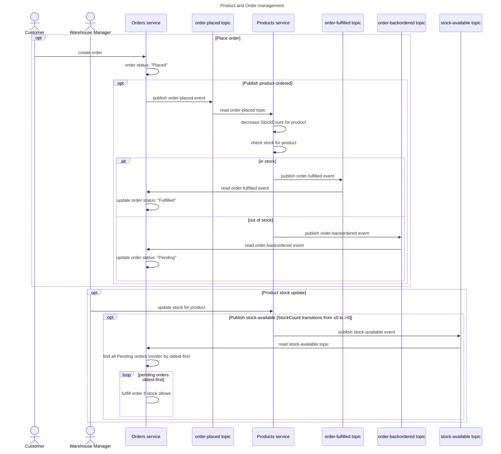

# Products Service

A basic product management HTTP microservice for managing stock levels and stock availability for a catalogue of Products. Operates alongside a complimentary order management HTTP microservice to provide an Order fulfilment and Products management system.

The microservice uses an in-memory product catalogue, no product data persistence is implemented.

The microservices are integrated by a pub/sub flow with Dapr.

# Service endpoints
## Get product by id
`GET /Products/{id}`

Returns the requested Product object as JSON.

```json
{
  "id": "string",
  "name": "string",
  "inStock": false,
  "stockCount": 0
}
```

## Get all products
`GET /Products/`

Returns a list of product objects as JSON.

```json
[
  {
    "id": "string",
    "name": "string",
    "inStock": false,
    "stockCount": 0
  },
  {
    "id": "string",
    "name": "string",
    "inStock": false,
    "stockCount": 0
  }
]
```

## Update product stock
`PUT /Products/{id}/stock`

```json
{
  "stockCount": 0
}
```

Updates the stock level for the given Product.

# Event-driven integrations
The Products Service integrates with event topics using a pub/sub flow with a Dapr sidecar:

| Topic | Publish/Subscribe | Description |
|-|-|-|
| `stock-available` | Publish | Publish information about Product stock levels when a product is restocked |
| `order-placed` | Subscribe | Read information about a newly placed order |
| `order-fulfilled` | Publish | Publish that an order can be fulfilled based on order details and available stock |
| `order-backordered` | Publish | Publish that an order cannot be fulfilled and is backordered based on order details and available stock |

## Stock available
If a product's stock level is above 0 then the product is `inStock` and any pending orders can be filled.

A Warehose Manager can update the stock level for a given product. If a product's stock level is updated and it is now `inStock`, the Products Service will emit a `stock-available` event.

```json
{
  "productId": "p001",
  "stockCount": 10,
}
```

Services subscribing to the `stock-available` topic can act on that event accordingly.

## Order placed
When a Customer places an order through an external system, an event is published to the `order-placed` topic.

```json
{
  "orderId": "abc123",
  "productId": "p001",
  "quantity": 1
}
```

Orders can be placed only for one product at a time. One or more items of that product can be orderd in a single transaction.

The Products Service subscribes to the `order placed` topic and decreases the `StockCount` for a product when a new order is placed.

A User can place an order for a product, even if the product is out of stock. The Products Service will listen to the `order-placed` topic and reduce the stock count for the product accordingly.

## Order fulfilled
When the Products Service is processing a new order, if there is enough stock to fulfil that order then an event is published to the `order-fulfilled` topic to indicate that the order has been fulfilled and stock levels have been adjusted.

```json
{
  "orderId": "abc123",
  "fulfilled": true,
  "productId": "p001"
}
```

Services subscribing to the `order-fulfilled` topic can act on that event accordingly.

## Order backordered
When the Products Service is processing a new order, if there is not enough stock to fulfil that order then an event is published to the `order-backordered` topic.

```json
{
  "orderId": "abc123",
  "fulfilled": false,
  "productId": "p001"
}
```

Services subscribing to the `order-backordered` topic can act on that event accordingly.

# Tool chain
- VSCode, Docker Desktop, .NET8.0, C#
- VSCode extensions:
    - .NET Extension Pack
    - C# base language support
    - C# Dev Kit
    - Azure Resources
    - Container Tools
    - Docker
    - Mermaid Chart

# Hosting environment
All services deployed to Azure, using:
- Azure Container Registry
- Container Apps Environment
- Azure Container Apps

# Local development
## Run and Debug
1. Check out tip of `main`
2. VSCode -> Run and Debug -> "Docker: Launch .NET Core" debug profile
3. Containerised debug session started -> Browser opens -> Swagger UI available on `/swagger/`

## Code changes
Trunk based development -> Commit changes to `main` and push to origin

## Build container image and push to Container Registry
1. Explorer -> right-click Dockerfile -> Build Image... -> new image created
2. Containers -> Registried > Connect Reigstry
3. Containers -> Images -> productservice/lastest -> Push...

# Cloud deployment

# Future CI/CD
- Use Github PR process for merges to origin
    - Automate PRs using GenAI code review agent
    - Automate code quality checks
    - Human in the loop to approve PR before merge
- On merge to `main`
    - Automate creation new Docker image and push to ACR
    - Automate creation of new revision microservice and deploy new image

# 

# Sequence diagram


[Viewable externally on sequencediagram.org](https://sequencediagram.org/index.html#initialData=C4S2BsFMAIAUCcD2ATArgY2NAhgO2dAPLzKTzQC2e2A5pBZLsAFDPaaLkDCqAzsIgbw2HcgHVs8SAAtEfGAFlqdYcwAOk0OhAamREmV7ReZAG4h0kdZos68WTqXgBaNeHaQCAtRevwtdnoIKBjARibw5pZ+AboOBi4AZqjgiSDgUF6IPugxtnHQjmTOAEbsANZFUlk5edoF-Ijo5c7Yptjp2CVQ0N6+zDRIqGpw7paFCcw8jULOAHzETuFmFpAAXOhS2MAwVcyLhsYrlvMH8MuRq2sTTsbA23zXAESwY55PA0MjsKjdILzSaBqJBoTDOKqefYJC5RSDzKquN41CzXNS-cD-QEItweAiQUyMFjYpG9bIWebBUFhI6XSzXLYEYm40m1SmhGGrCkg9k02HXUibSDYEzQADKAmaXDkekSnCB3MwzDZmA5JzmyupET50HQ0kgzTuTXK0Fl5GBIUV2HAWBAuENzSVCs1xzhcwRyVS6UyLJRQPRmJuxQ9aQynmg+MJzHdKRD3r66FO0N5V2gDMDSRjXrDEaYUKWybVZ1V62gw2Q212CTuD14zwAYpnQ8gPpBwCK5A5Evbyo6Lc7aa6EWVmhDkehUf6AenShVR+GCbmh7OEmH44n81qU2mlyOV3iFywiwXXUfN3TS2pyzt09XgI9oC9GMhbTQW-hmE+P+-PnJvk7uxeV5WBIUiyPI0BKLgtDFOqTrFtcZYVgBpryn2P7DHAk6Ao0zStO0nTdDAADa4pGlKqB6MA8B4LwYAgIguBGIkSAUNAgAmRAADKS0BzBxAC6rAasW8w4S0bQdO4hE+uOaJ-FOol4RJXQ9DmLAKeJBE9GuCxJme6xpup+GSVpZK5KeLrrocenXGk+A4BkcBPi+6a8AANAAOrgVTQCUACehTgKQ-DOGk5wsOAiDZECTm4DQLkBUFwAhSAYV5lZFk6RuLo2Y24A3iAXaifZEUAO68Kwn6VfgQA)