# Products Service

A basic product management HTTP microservice for managing stock levels and stock availability for a catalogue of Products. Operates alongside a complimentary order management HTTP microservice to provide an Order fulfilment and Products management system.

The microservice uses an in-memory product catalogue, no product data persistence is implemented.

The microservices are integrated by a pub/sub flow with Dapr.

# Service endpoints
## Get product by id
`GET /Products/{id}`

Returns the requested Product object as JSON.

```json
{
  "id": "string",
  "name": "string",
  "inStock": false,
  "stockCount": 0
}
```

## Get all products
`GET /Products/`

Returns a list of product objects as JSON.

```json
[
  {
    "id": "string",
    "name": "string",
    "inStock": false,
    "stockCount": 0
  },
  {
    "id": "string",
    "name": "string",
    "inStock": false,
    "stockCount": 0
  }
]
```

## Update product stock
`PUT /Products/{id}/stock`

```json
{
  "stockCount": 0
}
```

Updates the stock level for the given Product.

# Event-driven integrations
The Products Service integrates with event topics using a pub/sub flow with a Dapr sidecar:

| Topic | Publish/Subscribe | Description |
|-|-|-|
| `stock-available` | Publish | Publish information about Product stock levels when a product is restocked |
| `order-placed` | Subscribe | Read information about a newly placed order |
| `order-fulfilled` | Publish | Publish that an order can be fulfilled based on order details and available stock |
| `order-backordered` | Publish | Publish that an order cannot be fulfilled and is backordered based on order details and available stock |

## Stock available
If a product's stock level is above 0 then the product is `inStock` and any pending orders can be filled.

A Warehosue Manager can update the stock level for a given product. If a product's stock level is updated and it is now `inStock`, the Products Service will emit a `stock-available` event.

```json
{
  "productId": "p001",
  "stockCount": 10,
}
```

Services subscribing to the `stock-available` topic can act on that event accordingly.

## Order placed
When a Customer places an order through an external system, an event is published to the `order-placed` topic.

```json
{
  "orderId": "abc123",
  "productId": "p001",
  "quantity": 1
}
```

Orders can be placed only for one type of product at a time. One or more items of that product can be ordered in a single transaction.

The Products Service subscribes to the `order placed` topic and decreases the `StockCount` for a product when a new order is placed.

A User can place an order for a product, even if the product is out of stock. The Products Service will listen to the `order-placed` topic and reduce the stock count for the product accordingly.

## Order fulfilled
When the Products Service is processing a new order, if there is enough stock to fulfil that order then an event is published to the `order-fulfilled` topic to indicate that the order has been fulfilled and stock levels have been adjusted.

```json
{
  "orderId": "abc123",
  "fulfilled": true,
  "productId": "p001"
}
```

Services subscribing to the `order-fulfilled` topic can act on that event accordingly.

## Order backordered
When the Products Service is processing a new order, if there is not enough stock to fulfil that order then an event is published to the `order-backordered` topic.

```json
{
  "orderId": "abc123",
  "fulfilled": false,
  "productId": "p001"
}
```

Services subscribing to the `order-backordered` topic can act on that event accordingly.

# Tool chain
- VSCode, Docker Desktop, .NET8.0, C#, Dapr CLI
- VSCode extensions:
    - .NET Extension Pack
    - C# base language support
    - C# Dev Kit
    - Azure Resources
    - Container Tools
    - Docker & Docker Compose
    - Mermaid Chart

# Local development
## Dapr CLI
### Install
Install the Dapr CLI from Powershell
```
iwr -useb https://raw.githubusercontent.com/dapr/cli/master/install/install.ps1 | iex
```
or from the command prompt
```
winget install Dapr.CLI
```
### Verify
After Dapr CLI is installed, verify the installation with `dapr --version`. It should return:
```
CLI version: 1.15.1
Runtime version: n/a
```
### Initialise
Initalise Dapr to set up the Dapr CLI runtime
```
dapr init
```
This will create and start 4 Docker containers:
- dapr_redis
- dapr_zipkin
- dapr_scheduler
- dapr_placement

## Run and Debug
### Local ProductsService
1. VSCode -> Run and Debug -> "C#: ProductsService debug" debug profile
2. Swagger UI opens on http://localhost:8080/swagger/index.html

No dapr components running & no pubsub

### Local ProductsServices + Dapr sidecare + containerised Redis
1. Terminal > Powershell > browse to project folder where `ProductsService.csproj` is located
```
\ProductsService\ProductsService\ProductsService>
```

2. Build the project
```
dotnet build
```

3. Start the project and dapr side-car
```
dapr run --app-id productsserrvice --components-path ../components/ --app-port 8080 -- dotnet run --project .
```

4. Open project at `http://localhost:8080/swagger`

### Containerised ProductsService
1. VSCode -> Run and Debug -> "Docker: Launch .NET Core" debug profile
2. Browser opens on http://localhost:32769/
3. Swagger UI available on http://localhost:32769/swagger/index.html

> No dapr components running & no pubsub

## Code changes
Trunk based development -> Commit changes to `main` and push to origin

## Build container image and push to Container Registry
1. Explorer -> right-click Dockerfile -> Build Image... -> new image created
2. Containers -> Registried > Connect Reigstry
3. Containers -> Images -> productservice/lastest -> Push...

# Azure Hosting environment
All services deployed to Azure, using:
- Azure Container Registry
- Container Apps Environment
- Azure Container Apps

# Cloud deployment

# Future CI/CD
- Use Github PR process for merges to origin
    - Automate PRs using GenAI code review agent
    - Automate code quality checks
    - Human in the loop to approve PR before merge
- On merge to `main`
    - Automate creation new Docker image and push to ACR
    - Automate creation of new revision microservice and deploy new image

# 

# Sequence diagram

```mermaid
sequenceDiagram
  title Product and Order management

  actor Customer
  actor Warehouse Manager

  participant Orders service
  participant order-placed topic
  participant Products service
  participant order-fulfilled topic
  participant order-backordered topic
  participant stock-available topic

  opt Place order
    Customer->>Orders service:create order
    Orders service->>Orders service: order status: "Placed"
    opt Publish product-ordered
    Orders service->>order-placed topic: publish order-placed event
    order-placed topic->>Products service: read order-placed topic
    Products service->>Products service: check stock for product
      alt in stock
        Products service->>Products service: decrease StockCount for product
        Products service->>order-fulfilled topic: publish order-fulfilled event
        order-fulfilled topic->>Orders service: read order-fulfilled event
        Orders service->>Orders service: update order status: "Fulfilled"
      else out of stock
        Products service->>Products service: decrease StockCount for product
        Products service->>order-backordered topic: publish order-backordered event
        order-backordered topic->>Orders service: read order-backordered event
        Orders service->>Orders service: update order status: "Pending"      
      end
    end
  end
  opt Product stock update
    Warehouse Manager->>Products service: update stock for product
    opt Publish stock-available [StockCount transitions from ≤0 to >0]
      Products service->>stock-available topic:publish stock-available event
      stock-available topic->>Orders service:read stock-available topic
      Orders service->>Orders service: find all Pending orders,\norder by oldest-first
      loop pending orders oldest-first
        Orders service->>Orders service: fulfill order if stock allows
      end
    end
  end
```


[Viewable externally on sequencediagram.org](https://sequencediagram.org/index.html#initialData=C4S2BsFMAIAUCcD2ATArgY2NAhgO2dAPLzKTzQC2e2A5pBZLsAFDPaaLkDCqAzsIgbw2HcgHVs8SAAtEfGAFlqdYcwAOk0OhAamREmV7ReZAG4h0kdZos68WTqXgBaNeHaQCAtRevwtdnoIKBjARibw5pZ+AboOBi4AZqjgiSDgUF6IPugxtnHQjmTOAEbsANZFUlk5edoF-Ijo5c7Yptjp2CVQ0N6+zDRIqGpw7paFCcw8jULOAHzETuFmFpAAXOhS2MAwVcyLhsYrlvMH8MuRq2sTTsbA23zXAESwY55PA0MjsKjdILzSaBqJBoTDOKqefYJC5RSDzKquN41CzXNS-cD-QEItweAiQUyMFjYpG9bIWebBUFhI6XSzXLYEYm40m1SmhGGrCkg9k02HXdDSSDNO5NcrQRKcIHczBscBYEC4EXNZhszAck5zVXUiJ86CkTaQbAmaAAZQEzS4cj0EvIwJCMq16rhcwRyVS6UyLJRQPRmJuxTdaQynmg+MJzFdKSDnr66FO0N5V2gDP9SSjHpDYaYUKWiY1Zyd12GyG2uwSdwevGeADF08HkB9IOBjXIHIkleUVdLtcdnY68+s9UKtsazaLLahrZK7VSu-ae7TnQiys0Icj0KjfQDU6UKmvQwTs8u9wkQ7H47mdUmU8fV6e8YeWAWBxfDle6dBi6XUxXgI9oC8jDIAqNCNvgzBARB4GfHI3zdh2n5qCWOzMBIUiyPI0BKLgtDFJq3aFohyEwI0wo2lK84wcMcBboCpEtG0HTuN0MAANpjhaVpYMA8B4LwYAgIguBGIkSAUNAgAmRAADKS0BzFJAC6rD9u+zr0a07SdCxXobmifzbupjFaT0WYsIZmnMT054LAmqlrCm5lMV0Vlkrkz6qa+5wDtcaT4DgGRwEBIGprwAA0AA6uBVNAJQAJ6FOApD8M4aTnCw4CINkQJBbgNAhQlSXAClIBpTmb69p5hGBh6P4gO29H+RlADuvCsJB7X4EAA)