# Products and Orders Management
An exercise to create two microservices for managing Orders and Product inventory.
- Communication between microservices will take place via a common Dapr pubsub component
- The microservices will be containerised using Docker
- The microservices will run locally in a Docker Compose stack and will communicate using Dapr pubsub backed by Redis Streams
- The microservices will be deployed to Azure Container Apps (ACA) and will communicate using Dapr pubsub backed by Azure Service Bus

## Prerequisites
- [Install](https://docs.dapr.io/getting-started/install-dapr-cli/) and [init](https://docs.dapr.io/getting-started/install-dapr-selfhost/) Dapr
- Install [Docker Desktop](https://www.docker.com/products/docker-desktop/) (includes [Docker Compose](https://docs.docker.com/compose/install/))

## Tool chain
- VSCode, Docker Desktop, .NET8.0, C#, Dapr CLI
- VSCode extensions:
    - .NET Extension Pack
    - C# base language support
    - C# Dev Kit
    - Azure Resources
    - Container Tools
    - Docker & Docker Compose
    - Mermaid Chart

## Sequence diagram


```mermaid
sequenceDiagram
  title Product and Order management

  actor Customer
  actor Warehouse Manager

  participant Orders service
  participant order-placed topic
  participant Products service
  participant order-fulfilled topic
  participant order-backordered topic
  participant stock-available topic

  opt Place order
    Customer->>Orders service:create order
    Orders service->>Orders service: order status: "Placed"
    opt Publish product-ordered
    Orders service->>order-placed topic: publish order-placed event
    order-placed topic->>Products service: read order-placed topic
    Products service->>Products service: check stock for product
      alt in stock
        Products service->>Products service: decrease StockCount for product
        Products service->>order-fulfilled topic: publish order-fulfilled event
        order-fulfilled topic->>Orders service: read order-fulfilled event
        Orders service->>Orders service: update order status: "Fulfilled"
      else out of stock
        Products service->>Products service: decrease StockCount for product
        Products service->>order-backordered topic: publish order-backordered event
        order-backordered topic->>Orders service: read order-backordered event
        Orders service->>Orders service: update order status: "Pending"      
      end
    end
  end
  opt Product stock update
    Warehouse Manager->>Products service: update stock for product
    opt Publish stock-available [StockCount transitions from ≤0 to >0]
      Products service->>stock-available topic:publish stock-available event
      stock-available topic->>Orders service:read stock-available topic
      Orders service->>Orders service: find all Pending orders,\norder by oldest-first
      loop pending orders oldest-first
        Orders service->>Orders service: fulfill order if stock allows
      end
    end
  end
```

[Viewable externally on sequencediagram.org](https://sequencediagram.org/index.html#initialData=C4S2BsFMAIAUCcD2ATArgY2NAhgO2dAPLzKTzQC2e2A5pBZLsAFDPaaLkDCqAzsIgbw2HcgHVs8SAAtEfGAFlqdYcwAOk0OhAamREmV7ReZAG4h0kdZos68WTqXgBaNeHaQCAtRevwtdnoIKBjARibw5pZ+AboOBi4AZqjgiSDgUF6IPugxtnHQjmTOAEbsANZFUlk5edoF-Ijo5c7Yptjp2CVQ0N6+zDRIqGpw7paFCcw8jULOAHzETuFmFpAAXOhS2MAwVcyLhsYrlvMH8MuRq2sTTsbA23zXAESwY55PA0MjsKjdILzSaBqJBoTDOKqefYJC5RSDzKquN41CzXNS-cD-QEItweAiQUyMFjYpG9bIWebBUFhI6XSzXLYEYm40m1SmhGGrCkg9k02HXdDSSDNO5NcrQRKcIHczBscBYEC4EXNZhszAck5zVXUiJ86CkTaQbAmaAAZQEzS4cj0EvIwJCMq16rhcwRyVS6UyLJRQPRmJuxTdaQynmg+MJzFdKSDnr66FO0N5V2gDP9SSjHpDYaYUKWiY1Zyd12GyG2uwSdwevGeADF08HkB9IOBjXIHIkleUVdLtcdnY68+s9UKtsazaLLahrZK7VSu-ae7TnQiys0Icj0KjfQDU6UKmvQwTs8u9wkQ7H47mdUmU8fV6e8YeWAWBxfDle6dBi6XUxXgI9oC8jDIAqNCNvgzBARB4GfHI3zdh2n5qCWOzMBIUiyPI0BKLgtDFJq3aFohyEwI0wo2lK84wcMcBboCpEtG0HTuN0MAANpjhaVpYMA8B4LwYAgIguBGIkSAUNAgAmRAADKS0BzFJAC6rD9u+zr0a07SdCxXobmifzbupjFaT0WYsIZmnMT054LAmqlrCm5lMV0Vlkrkz6qa+5wDtcaT4DgGRwEBIGprwAA0AA6uBVNAJQAJ6FOApD8M4aTnCw4CINkQJBbgNAhQlSXAClIBpTmb69p5hGBh6P4gO29H+RlADuvCsJB7X4EAA)

## Event-driven integrations
The Products Service integrates with event topics using a pub/sub flow with a Dapr sidecar:

| Topic | Products service | Order service | Description |
|-|-|-|-|
| `stock-available` | Publish | Subscribe | Publish information about Product stock levels when a product is restocked |
| `order-placed` | Subscribe | Publish | Publish information about newly placed orders |
| `order-fulfilled` | Publish | Subscribe | Publish that an order can be fulfilled based on order details and available stock |
| `order-backordered` | Publish | Subscribe | Publish that an order cannot be fulfilled and is backordered based on order details and available stock |

### Stock available
If a product's stock level is above 0 then the product is `inStock` and any pending orders can be filled.

A Warehosue Manager can update the stock level for a given product using the Products Service. If a product's stock level is updated and it is now `inStock`, the Products Service will emit a `stock-available` event.

```json
{
  "productId": "p001",
  "stockCount": 10,
}
```

The Orders Service subscribes to the `stock-available` topic and will update any `pending` orders if there is now enough available stock to fulfil them.

### Order placed
When a Customer places an order through the Orders Service, an event is published to the `order-placed` topic.

```json
{
  "orderId": "o001",
  "productId": "p001",
  "quantity": 1
}
```

Orders can be placed only for one type of product at a time. One or more items of that product can be ordered in a single transaction.

The Products Service subscribes to the `order-placed` topic and decreases the `StockCount` for a product when a new order is placed.

A User can place an order for a product, even if the product is out of stock. The Products Service will listen to the `order-placed` topic and reduce the stock count for the product accordingly.

### Order fulfilled
When the Products Service is processing a new order, if there is enough stock to fulfil that order then an event is published to the `order-fulfilled` topic to indicate that the order has been fulfilled and stock levels have been adjusted.

```json
{
  "orderId": "o001",
  "fulfilled": true,
  "productId": "p001"
}
```

The Orders Service subscribes to the `order-fulfilled` topic and will update the corresponding orders accordingly.

### Order backordered
When the Products Service is processing a new order, if there is not enough stock to fulfil that order then an event is published to the `order-backordered` topic.

```json
{
  "orderId": "o001",
  "fulfilled": false,
  "productId": "p001"
}
```

The Orders Service subscribes to the `order-fulfilled` topic and will update the corresponding orders accordingly.

## Products Service

A basic product management HTTP microservice for managing stock levels and stock availability for a catalogue of Products. Operates alongside a complimentary order management HTTP microservice to provide an Order fulfilment and Products management system.

The microservice uses an in-memory product catalogue, no product data persistence is implemented.

The microservices are integrated by a pub/sub flow with Dapr.

### Service endpoints
#### Get product by id
`GET /Products/{id}`

Returns the requested Product object as JSON.

```json
{
  "id": "string",
  "name": "string",
  "inStock": false,
  "stockCount": 0
}
```

#### Get all products
`GET /Products/`

Returns a list of product objects as JSON.

```json
[
  {
    "id": "string",
    "name": "string",
    "inStock": false,
    "stockCount": 0
  },
  {
    "id": "string",
    "name": "string",
    "inStock": false,
    "stockCount": 0
  }
]
```

#### Update product stock
`PUT /Products/{id}/stock`

```json
{
  "stockCount": 0
}
```
Updates the stock level for the given Product.

## Orders Service

A basic order management HTTP microservice for managing customer orders for products. Operates alongside a complimentary product management HTTP microservice to provide an Order fulfilment and Products management system.

A customer can place an order for only one product type at a time, but they can place an order for as many of those items as they like.

The microservice uses an in-memory list of orders, no order data persistence is implemented.

The microservices are integrated by a pub/sub flow with Dapr.

### Order status
A customer order can be in one of three states:
|Order status|Description|
|--|--|
|`placed`|The order has been placed and is being processed by the system|
|`fulfilled`|Stock is available to fulfil the order|
|`pending`|Stock is not available to fulfil the order, the order is pending stock availability before fulfilment|

### Service endpoints
#### Get Order by id
`GET /Orders/{id}/`
Returns the requested Order object as JSON.
```json
{
  "orderId": "o001",
  "productId": "p002",
  "quantity": 1,
  "status": "placed",
  "createdAt": "2025-07-18T10:21:74Z",
  "updatedAt": "2025-07-18T12:34:56Z"
}
```

#### Get Orders
`GET /Orders/`
Returns all Order objects as JSON
```json
[
  {
  "orderId": "o001",
  "productId": "p002",
  "quantity": 1,
  "status": "placed",
  "createdAt": "2025-07-18T10:21:74Z",
  "updatedAt": "2025-07-18T12:34:56Z"
  },
  {
  "orderId": "o002",
  "productId": "p001",
  "quantity": 15,
  "status": "pending",
  "createdAt": "2025-07-18T10:39:10Z",
  "updatedAt": "2025-07-18T10:39:17Z"
  },
  {
  "orderId": "o002",
  "productId": "p001",
  "quantity": 6,
  "status": "fulfilled",
  "createdAt": "2025-07-02T22:14:22Z",
  "updatedAt": "2025-07-03T08:54:68Z"
  }
]
```

#### Place Order
`POST /Orders/`
```json
{
  "productid": "p001",
  "quantity": 15
}
```
Creates a new order detailing the ordered product and the quanitity ordered.

# Running locally
## Local ProductsService + Dapr sidecar + Dapr Redis
1. `components/local/` > `pubsub.yaml` > `redisHost` value set to `localhost:6379`
```yml
  metadata:
    - name: redisHost
      value: localhost:6379 #for local development
      #value: redis:6379 #for running the stack with docker-compose
```
2. `dapr_redis` container RUNNING in Docker Desktop
3. From the ProductsService project root folder, run ProductsService and Dapr sidecar as local http services from Dapr CLI:
```
dotnet build

dapr run --app-id productsserrvice --resources-path ../components/local/ --app-port 8080 -- dotnet run --project .
```
4. Open project at `http://localhost:8080/swagger`
5. Attach debugger from CTRL+SHIFT+P > "Debug: Attach to .NET CORE process" if required.

## Local OrdersService + Dapr sidecar + Dapr redis
1. `components/local/` > `pubsub.yaml` > `redisHost` value set to `localhost:6379`
```yml
  metadata:
    - name: redisHost
      value: localhost:6379 #for local development
      #value: redis:6379 #for running the stack with docker-compose
```
2. `dapr_redis` container RUNNING in Docker Desktop
3. From the OrdersService project root folder, run OrdersService and Dapr sidecar as local http services from Dapr CLI:
```
dotnet build

dapr run --app-id ordersservice --resources-path ../components/local/ --app-port 8081 -- dotnet run --project .
```
4. Open project at `http://localhost:8081/swagger`
5. Attach debugger from CTRL+SHIFT+P > "Debug: Attach to .NET CORE process" if required.

## Containerised ProductsService + OrdersService + Dapr sidecars + Compose Redis
1. `components/local/` > `pubsub.yaml` > `redisHost` value set to `redis:6379`
```yml
  metadata:
    - name: redisHost
      #value: localhost:6379 #for local development
      value: redis:6379 #for running the stack with docker-compose
```
2. `dapr_redis` container STOPPED in Docker Desktop
3. From the Solution root folder, run ProductsService, OrdersService, the Dapr sidecars and redis as a Docker Compose stack:
```
docker compose up --build
```
4. Open ProductsService swagger UI at `http://localhost:8080/swagger`
4. Open OrdersService swagger UI at `http://localhost:8081/swagger`

# Code changes
Trunk based development -> Commit changes to `main` and push to origin

# Build container image
```
docker build --no-cache -t productsservice:latest .
```

# Deploy infrastrcture and app to Azure
Build and deployment is handled using `Powershell` scripts in the `/devops/` folder which are run from the commandline in the solution root.

Three scripts are prepared:
## 1. Deployment variables
`.\devops\variables.ps1` defines deployment variables for the deployment.

Increment the `$ATTEMPT_NO` value to reflect the deployment version.

## 2. Deploy infrastrcture
From the solution root folder in a Powershell terminal, run:
```bash
.\devops\infrastrcuture.ps1
```
This will create the required Azure services ready for app deployment.

## Build app image and deploy to ACA
From the solution root folder in a Powershell terminal, run:
```
.\devops\deploy-app.ps1
```
This will create or update a Azure Container App.

# Future CI/CD
- Use Github PR process for merges to origin
    - Automate PRs using GenAI code review agent
    - Automate code quality checks
    - Human in the loop to approve PR before merge
- On merge to `main`
    - Automate creation new Docker image and push to ACR
    - Automate creation of new revision microservice and deploy new image

# 